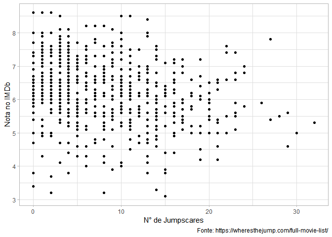

# Uma análise sobre filmes de terror e seus Jumpscares

  Todo mundo que já viu um filme de terror experienciou, querendo ou não, um jumpscare. Uma música que cria tensão, uma imagem que revela pouco a respeito do que está a seguir e, então, uma abrupta mudança ocorre: talvez um inimigo inesperado, talvez uma vítima (do filme) gritando. É uma quebra de expectativa que faz o coração do expectador saltitar.
  
  O site [Where's The Jump?](https://wheresthejump.com) contém uma base de dados com alguns filmes de terror e o número de jumpscares desses filmes. Pensei que seria uma boa ideia importar essa base de dados e depois avaliar as relações entre as notas do IMDb (uma outra base de dados que contém avaliações de filmes). Mãos à obra!

## Importando os dados do site

Primeiro, preciso encontrar uma maneira de importar a tabela em HTML disponível [aqui](https://wheresthejump.com/full-movie-list/"). Para tanto, utilizarei os pacotes `{rvest}` e `{jsonlite}`. Para análise dos dados, o conjunto de pacotes `{tidyverse}` será utilizado por mim. Mais a frente, pretendo utilizar o pacote `{ggfortify}` para criar gráficos de diagnóstico de regressão e `{broom}` para deixar testes de hipótese e resultados de modelos em formato *tidy*.


```r
library(rvest)
library(jsonlite)
library(tidyverse)
library(ggfortify)
library(broom)
```

Depois de importar os pacotes, eu irei definir a url de onde extrairei a base de dados e depois farei a leitura desse link usando a função `read_html()`. Depois disso, basta inspecionar os elementos da página e extrair o que é relevante para mim.


```r
# definindo a url
url <- 'https://wheresthejump.com/full-movie-list/'

# lendo o conteúdo em html da página
movie_page <- read_html(url)

# importando a tabela para o programa

scare_table <- movie_page %>% 
  html_nodes("table") %>% 
  html_table() %>% 
  .[[1]] %>% 
  as_tibble() %>% 
  select(
    "movie_name"=`Movie Name`, 
    "director" = Director,
    "year" = Year,
    "jump_count" = `Jump Count`,
    "is_netflix" = `Netflix (US)`,
    "imdb_rating" = IMDb
    )

# salvando a tabela num csv para uso posterior

write_csv(scare_table, 'jumpscaredb.csv')


scare_table
```

```
## # A tibble: 627 x 6
##    movie_name      director          year jump_count is_netflix imdb_rating
##    <chr>           <chr>            <int>      <int> <chr>            <dbl>
##  1 [Rec]           Jaume Balagueró~  2007         11 No                 7.5
##  2 10 Cloverfield~ Dan Trachtenberg  2016          8 No                 7.3
##  3 1408            Mikael Håfström   2007          8 No                 6.8
##  4 1917            Sam Mendes        2019         10 No                 8.5
##  5 1922            Zak Hilditch      2017          2 Yes                6.5
##  6 1BR             David Marmor      2019          3 No                 5.8
##  7 28 Days Later   Danny Boyle       2002         10 No                 7.6
##  8 28 Weeks Later  Juan Carlos Fre~  2007         17 No                 7  
##  9 30 Days of Nig~ David Slade       2007          9 No                 6.6
## 10 31              Rob Zombie        2016          8 No                 5.1
## # ... with 617 more rows
```

  Depois de importar os dados, verificamos que a `scare_table` tem 6 variáveis. São elas: o nome do filme, o nome de seus diretores, ano de seu lançamento, o número de jumpscares, se o filme está presente na Netflix dos EUA e a nota no IMDb.

## Uma breve análise exploratória

Agora que os dados já foram importados, eu iniciarei o processo de análise exploratória com o objetivo de responder algumas perguntas simples. Começando pela seguinte: qual a distribuição de filmes por ano?


```r
theme_set(theme_light()) # esse é meu tema predileto do ggplot2

ggplot(scare_table, aes(x = year)) +
  geom_histogram(color = 'black', fill ='white') + 
  labs(x = 'Ano',
       y = 'N° de filmes',
       title = 'Distribuição de filmes por ano', 
       caption = "Fonte: https://wheresthejump.com/full-movie-list/")
```

<!-- -->

  Há uma tendência clara no aumento do número de filmes ao longo dos anos. Com exceção do ano de 2020 que ainda está na metade (levando em conta a data em que este relatório foi gerado) e o COVID-19. 
  A próxima pergunta é a seguinte: qual a distribuição de jumpscares?
  

```r
ggplot(scare_table, aes(x = jump_count)) +
  geom_histogram(color = 'black', fill ='white') +
  labs(x = 'N° de Jumpscares',
       y = 'Quantidade de filmes',
       title = 'Distribuição de Jumpscares', 
       caption = "Fonte: https://wheresthejump.com/full-movie-list/")
```

<!-- -->

  Aparentemente, a maioria dos filmes tem menos de 20 jumpscares. Essa técnica de cinema está se tornando mais popular com o passar dos anos?
  

```r
ggplot(scare_table, aes(x = year, y = jump_count)) +
  geom_point(position = 'jitter') +
  labs(x = 'Ano',
       y = 'N° de Jumpscares',
       title = 'Contagem de Jumpscares por ano', 
       caption = "Fonte: https://wheresthejump.com/full-movie-list/")
```

<!-- -->
  
  Aparentemente, filmes mais recentes possuem um maior número de jumpscares. No entanto, isso pode estar acontecendo porque a duração dos filmes vem aumentando nos últimos anos. A base em questão não possui a duração dos filmes em minutos para que essa hipótese seja testada, mas algo nesse sentido pode ser feito num texto posterior.
  Uma outra pergunta interessante é a seguinte: a qualidade dos filmes de terror (assumindo que nota = qualidade) está aumentando com o passar dos anos?


```r
  ggplot(scare_table, aes(x = year, y = imdb_rating)) +
    geom_boxplot(aes(group = year))+
    labs(x = "Ano",
         y = 'Nota no IMDb',
         title = 'Nota dos filmes de Terror x Ano',
         caption = "Fonte: https://wheresthejump.com/full-movie-list/")
```

<!-- -->
  
  O último gráfico está bastante difícil de se visualizar e as barras de erro são grandes, mas a mediana das notas em cada ano parece estar caindo. Vou agrupar os filmes por ano e calcular a mediana das notas. Com esses dados criarei um novo gráfico.
  
  

```r
scare_table %>% 
  group_by(year) %>% 
  summarise(median_rating = median(imdb_rating)) %>% 
  ggplot(aes(x = year, y = median_rating)) + 
  geom_point() +
  labs(x = "Ano",
       y = "Mediana",
       title = 'Mediana de notas no IMDb x Ano',
       caption = "Fonte: https://wheresthejump.com/full-movie-list/")
```

<!-- -->

  Agora sim! A tendência de queda nas notas dos filmes é muito mais aparente quando levamos em conta a mediana por ano. No entanto, não podemos afirmar se os filmes estão piorando de qualidade ou se as pessoas que fazem essas resenhas têm preferências por filmes mais antigos. 
  Uma outra pergunta relevante, existe alguma relação entre as notas do IMDb e o número de jumpscares num filme?
  

```r
ggplot(scare_table, aes(x = jump_count, y = imdb_rating)) +
  geom_point() +
  labs(x = "N° de Jumpscares",
       y = "Nota no IMDb",
       caption = "Fonte: https://wheresthejump.com/full-movie-list/")
```

<!-- -->
  
  Visualmente falando, como no caso anterior, a relação parece não apontar para nenhuma tendência forte. Um teste de correlação pode ser útil para verificar se existe relação entre essas duas variáveis e se ela é estatísticamente significativa.
  

```r
corr_test <- cor.test(scare_table$jump_count, scare_table$imdb_rating)
tidy(corr_test)
```

```
## # A tibble: 1 x 8
##   estimate statistic p.value parameter conf.low conf.high method
##      <dbl>     <dbl>   <dbl>     <int>    <dbl>     <dbl> <chr> 
## 1   -0.219     -5.62 2.96e-8       625   -0.292    -0.143 Pears~
## # ... with 1 more variable: alternative <chr>
```

  O teste sugere que o coeficiente de correlação de pearson é diferente de zero e a estimativa é de $-0.2191468$. Ou seja, maiores números de jumpscares estão associados a menores notas no IMDb (o que não implica que uma cause a outra), mas a relação não é muito forte.
  Agora, vamos estimar um modelo linear no qual se supõe que as notas do IMDb sejam explicadas pelo número de jumpscares nos filmes. 
  

```r
# especificando o modelo

model <- lm((imdb_rating) ~ jump_count, data = scare_table)

# resultados do modelo

tidy(model)
```

```
## # A tibble: 2 x 5
##   term        estimate std.error statistic      p.value
##   <chr>          <dbl>     <dbl>     <dbl>        <dbl>
## 1 (Intercept)   6.50     0.0643     101.   0           
## 2 jump_count   -0.0336   0.00598     -5.62 0.0000000296
```
  Os parâmetros do modelo são estatisticamente significativos. O modelo sugere que quando o número de jumpscares é $0$, a nota no IMDb é $6.4988$. Cada jumpscare adicional diminui a nota no IMDb em $-0.03355$. Para ter certeza da qualidade desse modelo, vou utilizar gráficos de diagnóstico para verificar um possível problema de heterocedasticidade.
  

```r
# gráficos de diagnóstico
autoplot(model)
```

<!-- -->

```r
# teste de homocedasticidade
tidy(lmtest::bptest(model))
```

```
## # A tibble: 1 x 4
##   statistic p.value parameter method                        
##       <dbl>   <dbl>     <dbl> <chr>                         
## 1      1.45   0.229         1 studentized Breusch-Pagan test
```
  Os gráficos de diagnóstico sugerem que não há heterocedasticidade e o teste de Breusch-Pagan aponta que não se pode rejeitar a hipótese nula de homocedasticidade (os parâmetros estimados são eficientes). 
  
# Conclusões

  De acordo com o analisado até aqui, jumpscares aparentam ser estimadores razoáveis para as notas no IMDb. No entanto, o modelo estimado pode ter algum viés devido a omissão de variáveis importantes que auxiliam na explicação das notas no site de resenhas. Numa análise posterior, eu procurarei utilizar bases de dados que contenham informações referentes a orçamento e receita desses filmes e com isso responder outras perguntas interessantes. 
  No caso de críticas, dúvidas ou sugestões, por favor, mande-me um e-mail!

  
